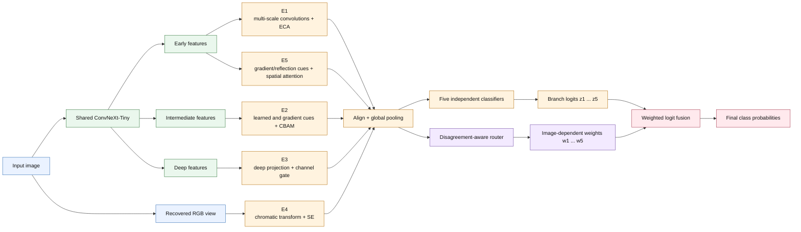

# Proposed Architecture

The paper uses neutral branch identifiers E1–E5. Descriptions below state the
implemented operations, not guaranteed or exclusive semantic roles.

## Inference path

E4 receives a recovered, de-normalized RGB view directly from the model input;
it does not come from a ConvNeXt feature layer. The other branches receive
hierarchical maps from the one shared backbone.

## Mathematical summary

Let the shared backbone provide hierarchical maps

\[
(F^{(e)},F^{(m)},F^{(d)})=B(x).
\]

Each branch implements a distinct transformation and produces a descriptor and
complete class prediction:

\[
h_i=\operatorname{GAP}(E_i(x,F^{(e)},F^{(m)},F^{(d)})),\qquad
z_i=H_i(h_i).
\]

The router uses all descriptors and their learned disagreement representation:

\[
w=\operatorname{softmax}(R(h_1,\ldots,h_5)/\tau),
\qquad \sum_{i=1}^{5}w_i=1.
\]

The deployed classifier is a convex mixture in logit space:

\[
z=\sum_{i=1}^{5}w_i z_i,
\qquad p(y\mid x)=\operatorname{softmax}(z).
\]

The primary loss supervises the fused logits. Auxiliary branch supervision and
small balance/diversity regularizers are controlled by command-line arguments,
not dataset-specific constants embedded in the architecture. The reported
checkpoint is selected by minimum validation loss.

## Interpretation figures

Two distinct figures should be reported:

1. Expert-specific Grad-CAM, where branch `Ei` is explained using its own
   logits and a target layer inside that branch.
2. Final-model Grad-CAM, where the fused logits are explained to visualize the
   deployed decision.

These visualizations can demonstrate different evidence patterns, but they do
not prove that a branch corresponds uniquely to a named clinical concept.
