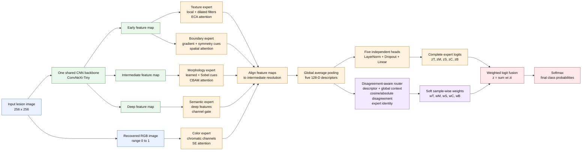
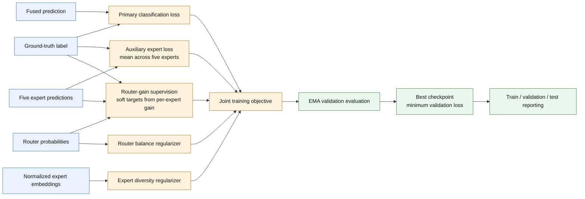

# Attention-Guided Five-Expert Lesion MoE

## Inference architecture

## Expert design

| Expert | Input | Specialized processing | Attention | Prediction |
|---|---|---|---|---|
| Texture | Early feature map | Depthwise local and dilated convolutions | ECA channel attention | Complete class logits `zT` |
| Morphology | Intermediate feature map | Learned features fused with Sobel gradient magnitude | CBAM channel-spatial attention | Complete class logits `zM` |
| Semantic | Deep feature map | Projected high-level semantic representation | Learned channel gate | Complete class logits `zS` |
| Color | Recovered RGB image | RGB, opponent-color differences, and color spread | SE channel attention | Complete class logits `zC` |
| Boundary | Early feature map | Gradient magnitude and horizontal/vertical symmetry differences | Spatial attention | Complete class logits `zB` |

All expert maps are projected to 128 channels and aligned to the intermediate
feature resolution. Each expert has its own classifier. Consequently, the
semantic path is one routed expert rather than an always-on baseline, and the
model has no separate no-correction route or additive delta-logit path.

## Training objective and model selection

During training, low-probability expert dropout prevents permanent dependence
on a single route. Router-gain targets are derived only from training labels;
validation and test inference use only the learned router. The checkpoint used
for final reporting is selected strictly by minimum validation loss.

## Paper notation

For expert `i` in `{texture, morphology, semantic, color, boundary}`:

`Fi = Expert_i(X, Fearly, Fintermediate, Fdeep)`

`pi = GAP(Fi)`

`zi = Head_i(pi)`

The router receives each descriptor, global expert context, pairwise cosine and
absolute disagreement, and a learned expert-identity embedding:

`w = softmax(Router({pi}) / tau)`, with `sum_i wi = 1`.

The deployed prediction is a convex mixture of complete expert logits:

`z = sum_i wi * zi`, followed by `p(y | X) = softmax(z)`.

Suggested figure caption: **Attention-guided lesion-specialized mixture of
experts with one shared CNN backbone. Hierarchical backbone features and the
recovered RGB image feed five complementary experts with expert-specific
attention. A disagreement-aware router assigns sample-dependent weights to
five complete class predictions, which are fused in logit space. The network
is trained jointly and the reported checkpoint is selected by minimum
validation loss.**
