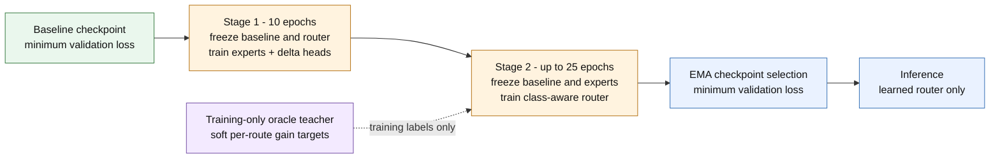

# Class-Aware Lesion Correction MoE (Router v3)

## Inference architecture

```mermaid
flowchart LR
    I["Lesion image<br/>256 x 256"] --> CNN["Frozen shared<br/>ConvNeXt-Tiny"]

    CNN --> FE["Early<br/>features"]
    CNN --> FM["Intermediate<br/>features"]
    CNN --> FD["Deep<br/>features"]

    FD --> BASE["GAP + LayerNorm<br/>baseline classifier"]
    BASE --> Z0["Semantic baseline<br/>logits z0"]

    FE --> TEX["Texture"]
    FM --> MOR["Morphology"]
    I --> COL["Color"]
    FE --> BND["Boundary"]

    TEX --> SET["Aligned expert maps<br/>{FT, FM, FC, FB}<br/>128 channels"]
    MOR --> SET
    COL --> SET
    BND --> SET

    SET --> POOL["Per-expert GAP<br/>{pT, pM, pC, pB}"]
    POOL --> HEAD["Four delta heads"]
    HEAD --> DELTA["Logit corrections<br/>{delta zi}"]

    Z0 --> CAND["Candidate predictions<br/>zi = z0 + delta zi"]
    DELTA --> CAND
    POOL --> ROUTER["Class-aware evidence router<br/>context + disagreement<br/>uncertainty + class probabilities"]
    CAND --> ROUTER
    Z0 --> ROUTER

    ROUTER --> W["Soft routing weights<br/>{w0, wT, wM, wC, wB}"]
    Z0 --> FUSE["Residual fusion<br/>z = z0 + sum wi delta zi"]
    DELTA --> FUSE
    W --> FUSE
    FUSE --> OUT["Final class<br/>probabilities"]

    classDef input fill:#EAF2FF,stroke:#3973B7,color:#111;
    classDef base fill:#EAF7ED,stroke:#3A7D44,color:#111;
    classDef expert fill:#FFF3DF,stroke:#B67416,color:#111;
    classDef route fill:#F3EAFF,stroke:#7550A5,color:#111;
    classDef result fill:#FFE9ED,stroke:#A83D52,color:#111;
    class I input;
    class CNN,FE,FM,FD,BASE,Z0 base;
    class TEX,MOR,COL,BND,SET,POOL,HEAD,DELTA,CAND expert;
    class ROUTER,W route;
    class FUSE,OUT result;
```

### Specialist details

| Specialist | Source | Main operations | Output |
|---|---|---|---|
| Texture | Early backbone map | 1x1 projection, depthwise 3x3 and dilated 3x3, residual block | `FT` |
| Morphology | Intermediate map | 1x1 projection, Sobel gradient magnitude, learned fusion, residual block | `FM` |
| Color | Recovered RGB image | Six chromatic channels, lightweight strided CNN, projection, residual block | `FC` |
| Boundary | Early backbone map | Gradient magnitude, horizontal/vertical flip differences, learned fusion | `FB` |

All four maps are aligned to the intermediate feature resolution before global
pooling. The semantic baseline is not a fifth correction expert; it is the
protected reference prediction. The fifth router option, `w0`, means no
correction.

## Two-stage training protocol

## Paper notation

For specialist route `i` in `{texture, morphology, color, boundary}`:

`Fi = Expert_i(input features)`, `pi = GAP(Fi)`, and `delta zi = Head_i(pi)`.

The router predicts five normalized weights:

`w = softmax(Router(evidence) / tau)`, where `sum_i wi + w0 = 1`.

The deployed prediction is:

`z = z0 + sum_i wi * delta zi`.

The no-correction route has zero delta, so increasing `w0` preserves more of
the semantic baseline. The oracle router is a training/diagnostic upper bound
that uses known labels; it is not part of deployable validation or test
inference.

Suggested figure caption: **Class-aware residual mixture-of-experts for skin
lesion classification. A frozen shared CNN provides the semantic baseline and
hierarchical feature maps. Four lesion-specialized experts generate additive
class-logit corrections. A class-aware evidence router assigns soft,
sample-dependent weights to an explicit no-correction route and the four
specialists. The final prediction is the immutable baseline plus the weighted
specialist corrections.**
